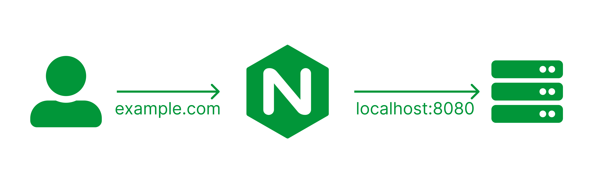
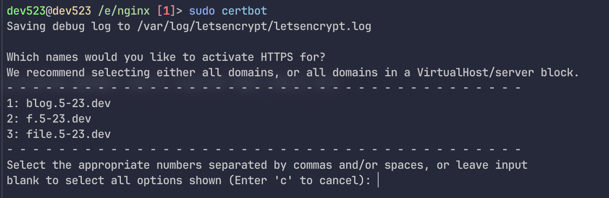

# 프록시 서버(Proxy Server)
프록시 서버는 서버의 보안을 향상시키기 위해 사용됩니다.

## 뭐를 할수 있어?
- 포트 숨기기
- ddos 걸러내기
- CORS(Cross-Origin Resource Sharing)설정

## nginx?
nginx를 리버스-프록시(reverse-proxy)라는 기법을 사용합니다.<br/>
클라이언트가 nginx서버에 요청을 넣으면 nginx서버에서 localhost에 있는 서버에 있는 정보를 클라이언트에 전달합니다.


## 포트 숨기기
nginx를 사용하면 쉽게 웹사이트의 포트를 숨길수 있습니다.
```
server {
    charset utf-8; // utf-8로 인코딩
    server_name  f.5-23.dev; // 서버 도메인
    location / {
        proxy_pass http://127.0.0.1:8080; // 열려있는 local도메인
    }
}
```

## ddos방어
ddos를 방어하는방법은 여러가지가 있습니다.

### 요청 수 제한걸기
요청수를 제한걸면 봇에의한 많은 요청을 줄일수 있습니다.
- `$binary_remote_addr`: client의 ip를 기준으로 제한을 줌
- `zone=one:10m`: one이라는 이름의 zone을 만들고, 10m의 용량을 할당
- `rate=30r/m`: 분마다 30개의 요청(request)를 받을수 있음
```
limit_req_zone $binary_remote_addr zone=one:10m rate=30r/m;
server {
    location /login {
        limit_req zone=one;
    }
}
```

### 연결 수 제한걸기
한 페이지에 요청이 몰리는걸 막을수 있습니다.
- `$binary_remote_addr`: client의 ip를 기준으로 제한을 줌
- `zone=addr:10m`: addr이라는 이름의 zone을 만들고, 10m의 용량을 할당
```
limit_conn_zone $binary_remote_addr zone=addr:10m;

server {
    location /gooods {
        limit_conn addr 10; // 10개의 클라이언트가 동시에 연결 가능
    }

}
```

### 느린 서버 연결 끊기
오래동안 연결 요청을 보내는것을 없에 요청량을 줄일수 있습니다.
```
server {
    // 5초 이상 연결하면 끊음
    client_body_timeout 5s;
    client_header_timeout 5s;
}
```

### ip 막기
요청이 계속 날아와 의심되는 ip를 막아 요청을 줄일수 있습니다.
```
location / {
    deny 123.123.123.1;
    deny 123.456.789.1;
    deny 111.222.333.1;
}
```

## Cors(Cross-Origin Resource Sharing)
- `Access-Control-Allow-Origin`: 허용할 도메인(`*`을 넣으면 모든 도메인이 허용된다)
- `Access-Control-Allow-Methods`: 허용할 메서드
```
server {
  location / {
    add_header 'Access-Control-Allow-Origin' 'iusearchbtw.com';
    add_header 'Access-Control-Allow-Methods' 'GET, POST, OPTIONS';
    add_header 'Access-Control-Allow-Headers' 'DNT,User-Agent,X-Requested-With,If-Modified-Since,Cache-Control,Content-Type,Range';
    add_header 'Access-Control-Expose-Headers' 'Content-Length,Content-Range';
  }
}
```

## https활성화
certbot이라는걸 이용해서 ssl인증서를 발급받을수 있습니다.(nginx에 적용은 자동으로 된다)

### install
arch
```shell
yay -S certbot
```

debian
```shell
sudo apt-get install letsencrypt
```

### 활성화
nginx가 잘 작동한다면 다음과 같은 명령어를 사용해서 설정할수 있습니다.<br>
만약 처음 썼다면 약관 동의와 이메일 입력이 나올텐데 약관 동의후, 이메일을 입력해주면 됩니다.<br>
```
sudo certbot
```


```shell
sudo nginx -s reload
```