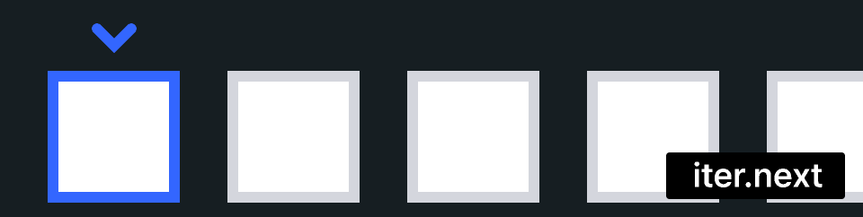
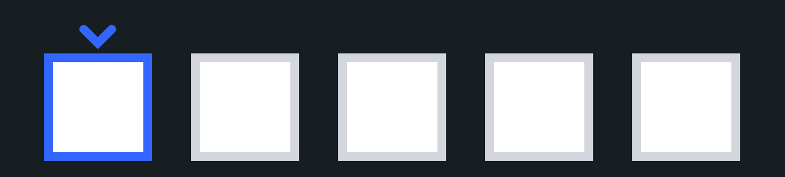
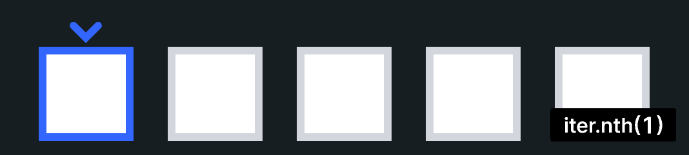

# 이터레이터(Iteractor)
`for i in 여기`에 들어갈수 있는값을 이터러블(Iterable)한 값이라고 하고 Iterator가 구현된 값이 들어갑니다.<br>
~~더 설명할게 없으니 그냥 많이쓰는 러스트의 Iterator Method나 알아봅시다~~
## next
iter의 다음값을 가저온다.
```rs
fn main() {
    let mut a = [1, 2, 3].iter();
    println!("{}", a.next().unwrap());
    println!("{}", a.next().unwrap());
    println!("{}", a.next().unwrap());
}
```


## cycle
next를 사용했을떄 다음이 없다면 커서를 처음으로 보낸다
```rs
fn main() {
    let mut a = [1, 2, 3].iter().cycle();
    println!("{}", a.next().unwrap());
    println!("{}", a.next().unwrap());
    println!("{}", a.next().unwrap());
    println!("{}", a.next().unwrap());
}
```


## nth
자기가 원하는 인덱스로 갈수있다.
_cycle과 같이쓰면 재미있게 사용할수 있다_
```rs
fn main() {
    let mut a = [1, 2, 3, 4, 5].iter();
    println!("{}", a.nth(0).unwrap());
    println!("{}", a.nth(2).unwrap());
    println!("{}", a.nth(1).unwrap());
    println!("{}", a.nth(3).unwrap());
    println!("{}", a.nth(4).unwrap());
}
```
