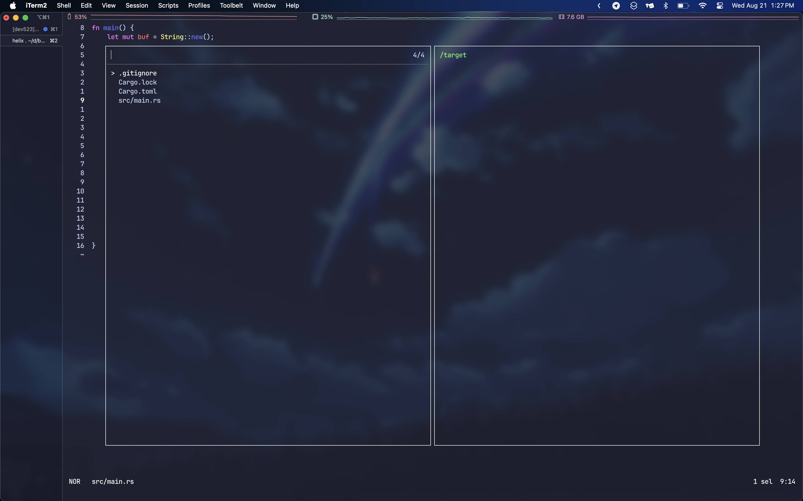

---

title: HELIX EDITOR 기초 사용법
published: 2024-08-21
description: 러스트의 사용법과 기본 문법 정리
image: thumb.jpg
tags: [helix, editor, 사용법, use]
category: helix
draft: false

---

# 움직이기
- 왼쪽: `w`
- 아래: `j`
- 오른쪽: `k`
- 위: `l`
- `화살표키`

# 다른파일 열기
`space - f`이후 원하는거 선택헤서 `enter`

## 다른창으로 열기(오른쪽)
`다른파일 열기`의 명령어만 쓴후 원하는 파일에서 `ctrl - v`

## 다른창으로 열기(아래)
`다른파일 열기`의 명령어만 쓴후 원하는 파일에서 `ctrl - s`

## 창 움직이기
`space - w - w`

# 선택하기
- 줄 선택: `x`
- 모두 선택: `%`
- arg선택: `mim`
- 선택 취소: `;`

# 복붙
선택한거 복사: `y`
붙여넣기: `p`

delete: d
# 인덴트(탭) 주기
- 인덴트 추가: `>`
- 인덴트 제거: `<`

# 둘러싸인거
- 둘러싸인 문자 양끝에 문자추가: `ms - [text]`
- 둘러싸고있는 [select] 문자 수정: `mr[select] - [text]`
- 둘러싸고있는 문자 제거(", ', <>, (), [] 등등): `mdm`