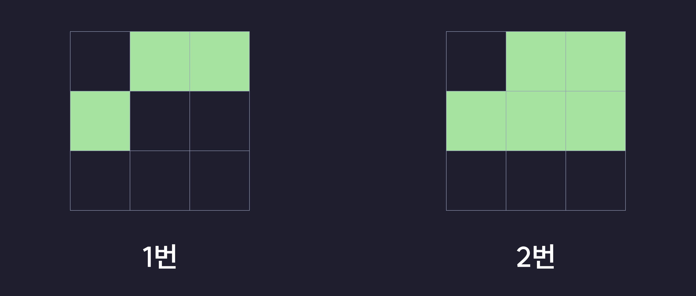
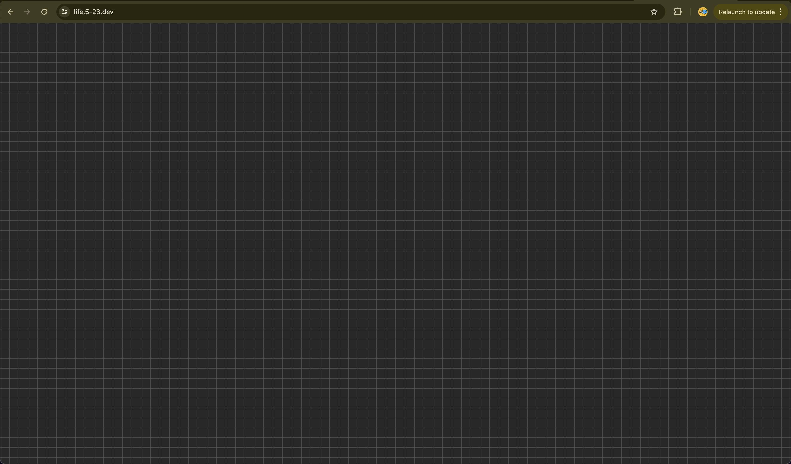

# 규칙
Game of Life은 간단한 2가지의 규칙으로 돌아간다.
1. 죽은 칸에 접한 8칸 중 정확히 3칸에 세포가 살아 있다면 해당 칸의 세포는 그 다음 세대에 살아난다.
2. 살아있는 칸과 접한 8칸 중 2칸미만 또는 3칸초과의 세포가 살아 있다면 해당 칸의 세포는 죽는다.
- - -
- 1번 사진은 중항을 기준으로 근처에 3칸의 살아있는 세포가 있으니 살아난다.
- 2번 사진은 중항을 기준으로 근처에 2칸 미만 또는 3칸 초과의 살아있는칸이 있으니 세포가 죽는다.


# 알고리즘 생각하기
1. 죽어있는 세포와 살아있는 세포의 위치를 모두 배열에 넣는다.
2. 살아있는 세포의 위치 인덱스만을 모아놓은 배열을 만들어 구현한다.

이런식으로 2가지방법이 있다.<br/>
- 1번 방법의 경우 구현하기는 2번보다 쉽지만 맵을 크게 만들기에는좀 무리가 있다.
- 2번 방법의 경우에는 구현하기가 좀 어렵지만 맵을 크게구현해도 세포의 살아있는칸의 위치만 기억하니 용량도 적고 최적화도 잘된다.(그리고 맵을 무한하게도 만들수 있다)


# 프로젝트 초기화하기
이제 프로젝트를 초기화해보자

# 명령어
```
cargo install wasm-pack
wasm-pack new game-of-life
cd life-of-game
```

# src > lib.rs
```rs
mod utils;
use wasm_bindgen::prelude::*;
```

# Cargo.toml
Cargo.toml은 [**__이렇게__**](https://github.com/5-23/life-of-game/blob/main/Cargo.toml)바꿔준다


# 프로그래밍 시작
이제 Game of Life을 만들어보자

## enum, struct만들기
enum을 통해서 세포의 상태를 만드는 이유는 세포의 상태를 직관적으로 상태를 볼 수 있기 때문에 사용한다
```rs
#[wasm_bindgen] // wasm으로 빌드하기위해 wasm_bindgen매크로를 써준다.
#[derive(Clone, Copy, Debug, PartialEq, Eq)] // 나중에 비교, 복사, 출력 등을 할수있으니 추가해준다
pub enum Cell {
    Dead,
    Alive,
}
```

```rs
#[wasm_bindgen]
pub struct LifeOfGame {
    alives: Vec<(isize, isize)>, // 살아있는 세포의 위치
    camera: (isize, isize), // 카메라의 위치(렌더링할떄 일정 부분만 보이게 하기위해 넣는다)
}

#[wasm_bindgen]
impl LifeOfGame {
    // 그냥 평범한 초기화 코드
    pub fn new() -> Self {
        Self {
            alives: vec![],
            camera: (0, 0),
        }
    } 
}
```

## 세포 삽입/삭제 구현
alives배열을 쉽게 관리하기위해 set메서드를 만든다.
```rs
#[wasm_bindgen]
impl LifeOfGame {
    // ..생략
    fn set(&mut self, i: isize, j: isize, state: Cell) {
        if state == Cell::Dead {
            // (i, j)에 살아있는 세포가 없으면 이미 죽어있는거니 굳이 안죽인다
            if self.alives.contains(&(i, j)) {
                self.alives.remove(
                    // (i, j)에 위치한 살아있는 세포의 인덱스를 가저옴
                    self.alives
                        .iter()
                        .enumerate()
                        .find(|x| x.1 == &(i, j))
                        .unwrap()
                        .0,
                );
            }
        } else {
            // (i, j)에 살아있는 세포가 있음면 이미 살아있는거니 추가하지 않는다
            if !self.alives.contains(&(i, j)) {
                self.alives.push((i, j));
            }
        }
    }
}
```

## 세포 값 변경하기
아까만든 set메서드를 활용해서 값을 반전시키는 메서드를 만든다.
```rs
#[wasm_bindgen]
impl LifeOfGame {
    // ..생략
    pub fn toggle(&mut self, i: isize, j: isize) {
        if self.alives.contains(&(i, j)) {
            self.set(i, j, Cell::Dead)
        } else {
            self.set(i, j, Cell::Alive)
        }
    }
}
```

## 다음값 확인하기
[#규칙](#규칙)에 있는걸 확인하여 1번 실행하는 step메서드를 만들어준다.

```rs
#[wasm_bindgen]
impl LifeOfGame {
    // ..생략
    pub fn step(&mut self) {
        // 한번에 바꾸지 않고 조금씩 바꾸면 문제가 생길수있으니 백터를 만들어 해결행다
        let mut changes = vec![];

        // 규칙에서 살아있는 세포의 위치만 확인하니 반복문에 넣어서 돌린다.
        for alive in &self.alives {
            let mut count = 0;
            // 살아있는 세포에 이웃한 인덱스를 받아오기위해 -1부터 1까지 반복문에 넣는다
            for i in -1..=1 {
                for j in -1..=1 {
                    // 자신을 제외하고 카운트한다
                    if i == 0 && j == 0 {
                        continue;
                    }
                    let x = alive.0 as i32 + i;
                    let y = alive.1 as i32 + j;

                    {
                        let mut count = 0; // 변수를 가릴수 있는걸 이용하여 변수를 만들어준다

                        // 위 반복문가 같은이유로 이런식으로 돌린다
                        for k in -1..=1 {
                            for l in -1..=1 {
                                let xx = x + k;
                                let yy = y + l;

                                count += self.alives.contains(&(xx as isize, yy as isize)) as i32;
                            }
                        }
                        // 살아있는세포가 3개면 새로운 세포가 태어난다
                        if count == 3 {
                            changes.push((x as isize, y as isize, Cell::Alive));
                        }
                    }
                    count += self.alives.contains(&(x as isize, y as isize)) as i32;
                }
            }
            // 살아있는세포가 2보다 작거나 3보다 크면 죽는다
            if 2 > count || count > 3 {
                changes.push((alive.0, alive.1, Cell::Dead));
            }
        }

        // 위에서 변경한다고 해준값을 반복문을통해 변경해준다
        for data in &changes {
            self.set(data.0, data.1, data.2)
        }
    }
}
```
## 그리기
```rs

#[wasm_bindgen]
impl LifeOfGame {
    // 자신이 보고있는부분을움직아는 메서드
    pub fn move_camera(&mut self, x: isize, y: isize) {
        self.camera.0 += x;
        self.camera.1 += y;
    }

    pub fn draw(&self, width: isize, height: isize) {
        let doc = web_sys::window().unwrap().document().unwrap(); // js의 document와 같은 객채를 가저옴
        let game = doc.get_element_by_id("game").unwrap(); // game이라는 id를 가진값을 가저옴

        let mut html = String::new();
        // id가 {i},{j}인 타일들을 그림
        for i in self.camera.1..(height + self.camera.1) {
            html.push_str("<div>");
            for j in self.camera.0..(width + self.camera.0) {
                html.push_str(&format!(
                    "<div type='button' id='{i},{j}' class='tile' {}></div>",
                    if self.alives.contains(&(i as isize, j as isize)) {
                        "alive" // 살아있을경우 alive attr을 추가해서 놔둠 
                    } else {
                        ""
                    }
                ));
            }
            html.push_str("</div>");
        }
        game.set_inner_html(&html);
    }
}
```

## 빌드하기
이제 wasm의 코드를 다 만들었으니 이 코드를 빌드해보자<br/>
아레 코드를쓰면 웹에서 쓸수있는 wasm이 `pkgs`폴더에 빌드될거다.
```fish
wasm-pack build --target web
```

## html 코드 작성
```html
<!DOCTYPE html>
<html lang="en">
<head>
    <meta charset="UTF-8">
    <meta notsus="i use nixos btw">
    <meta name="viewport" content="width=device-width, initial-scale=1.0">
    <title>Document</title>
</head>
<body>
    <!-- <input type="button" value="START" id="puse"><br/> -->
    <main id="game">a</main>
</body>
</html>
<script type="module">
import init, { LifeOfGame } from './pkg/wasm_pack_pra.js'
await init() // 초기화
alert("move: arrow key\npuse: space");
let game = LifeOfGame.new(); // 아까만든 게임객채 가저오기

draw();
let PUSE = 1;
let SPEED = 100;

function toggle(i, j) {
    game.toggle(i, j);
}
function draw() {
    game.draw(window.innerWidth / 20, window.innerHeight / 20);
    document.querySelectorAll("div.tile").forEach((button) => {
        if (button.id.indexOf(",") != -1) {
            // 클릭했을때 세포 반전시키기
            button.addEventListener('click', () => {
                let [i, j] = button.id.split(",").map(Number);
                toggle(i, j);
                draw();
            });
        }
    })
}
// 카메라 움직이기
window.onkeydown = (e) => {
    if (e.key == "ArrowRight") {
        game.move_camera(1, 0);
        draw();
    } if (e.key == "ArrowLeft") {
        game.move_camera(-1, 0);
        draw();
    } if (e.key == "ArrowDown") {
        game.move_camera(0, 1);
        draw();
    }
    if (e.key == "ArrowUp") {
        game.move_camera(0, -1);
        draw();
    }
    if (e.key == " ") {
        PUSE = !PUSE;
    }
    console.log(e.key)
}

setInterval(() => {
    // 멈추지 않았을때 한번씩 실행시키기
    if (!PUSE) {
        game.step();
        draw();
    }
}, 100);
</script>

<style>
    * {
        background-color: #282828;
        margin: 0;
        padding: 0;
    }
    body {
        overflow: hidden;
    }
    main {
        display: flex;
        flex-direction: column;
    }
    div {
        display: flex;
    }
    div.tile {
        border: solid #ffffff28 0.5px;
        width: 20px !important;
        height: 20px;
        /* background-color: red; */
        width: fit-content;
        &[alive] {
            background-color: #fff;
        }
    }
</style>
```
# 결과
완성하면 다음과 같은 결과가 나온다 <br/>
[코드](https://github.com/5-23/life-of-game) <br/>
[결과](https://life.5-23.dev) <br/>

