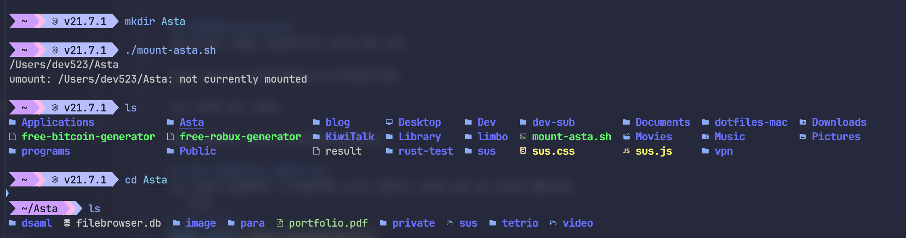

# nfs가 뭐야?
nfs는 클라이언트 컴퓨터의 사용자가 네트워크 상의 파일을 직접 연결된 스토리지에 접근하는 방식과으로 접근하도록 도와준다.
udp와 tcp통신을 둘다 지원하며, 인터넷 속도가 느리다면 udp로 빠르다면 tcp로 연결하여 사용하면 된다.

# 설치하기
arch
```fish
yay -S nfs-utils
```
debian
```fish
sudo apt install nfs-kernel-server
```

# 서버설정
위 명령어를 썼으면 아마 `/etc/exports`파일이 만들어젔을 것이다.<br/>
이제 저 파일을 열어서 수정해보자
```
여는걸/허용할/폴더 허용할/ip들(권한,sync,insecure,all_squash,no_subtree_check,anonuid=유저id,anongid=그룹id)
```
만약 모든 ip를 허용하고싶다는 `*`을 쓰면 된다.

## uid, gid구하기
```
$ id username
uid=1000(username) gid=1000(username) groups=1000(username),3(sys),998(wheel),981(rfkill)
```
이 명령어를 써서 uid와 gid가 1000임을 알수 있다.


## 설정파일 예시
아레는 내 설정파일이다<br/>
`/home/realsus/files`는 내가 열기를 허용할 파일을 의미하고<br/>
rw는 `읽기(read)` `쓰기(write)`권한을 의미한다.<br/>
내ip와 서버컴퓨터가 직접 접속할수 있는걸 원하니 `내ip/서버ip`를 써서 허용해줬고<br/>
나의 `uid`, `gid`는 `1000`이니 그렇게 써준다.
```
/home/realsus/files 192.192.192.192/0.0.0.0(rw,sync,insecure,all_squash,no_subtree_check,anonuid=1000,anongid=1000)
```

## 서버 실행
`exportfs`를 사용하여 아까 설정한 파일을 적용시켜주고 `systemctl`을 사용하여 nfs서버를 실행시켜준다.
```
sudo exportfs -a
sudo systemctl enable --now nfs-server.service
```

# 클라이언트에서 연결
나는 macos를 사용중이니 mac에서 연결하는방법만 쓰겠다.
다른os에서 연결하는방법은 다른사람들의 블로그를 참고하기 바란다.

## 폴더 만들기
먼저 `mkdir`을 사용해 연결(mount)할 폴더를 만들어준다.
```fish
mkdir myServer
```

## 연결(mount)하기
```
sudo mount -t nfs -o resvport,권한,noowners,vers=서버-버전 ip:/아까/설정에서/허용한/파일/주소 ./연결(mount)할/폴더/경로
```

예시는 다음과 같다.
나는 rw수정밑 읽기 권한을 허용했고 tcp로 연결했다 내 ip가 있는 도매인을 써줬고 다음으로는 내가 허용한 폴더의 경로를 써줬다.
만약 udp로 연결하고 싶다면 vers를 4가 아니라 3으로 바꿔주면 된다.
```
sudo mount -t nfs -o resvport,rw,noowners,vers=4 내-서버ip:/home/realsus/files /Users/realsus/myServer
```

## 연결해제(umount)하기
umount하는 방법은 연결하는것과 다르게 매우 쉽다.
```
sudo umount /아까/연결(mount)한/폴더/경로
```
나는 아레와 같이 써줬다 
```
sudo umount /Users/realsus/myServer
```
## 쉽게 연결할수있는 쉘파일 작성
나는 연결이 끊길때마다 다시명령어를 쓰는게 귀찮아서 아레와 같은 쉘 코드를 만들어놨다.
```fish
#!/bin/bash
MOUNT_PATH="/Users/realsus/Server"
echo $MOUNT_PATH
sudo umount $MOUNT_PATH
sudo mount -t nfs -o resvport,rw,noowners,vers=4 내-서버ip:/home/realsus/files $MOUNT_PATH
```
