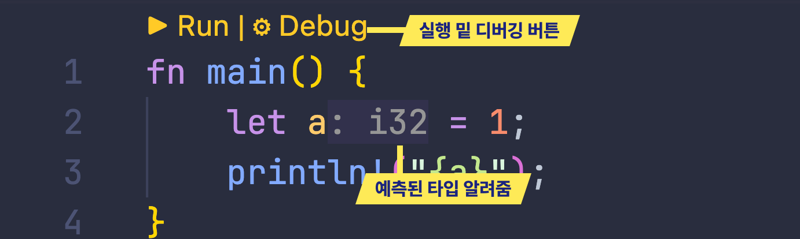

:::important
이 강좌는 기본적으로 c/cpp나 python같은 프로그래밍 언어를 해봤다는 가정하에 작성되었습니다 :D
:::

# Rust analyzer설치하기

[Rust analyzer](https://rust-analyzer.github.io/)는 Rust를 좀 더 쉽게 사용할수있도록 Qol기능(자동완성, 타입보여주기, 디버깅등등)을 보여주는 기능을 추가해주는 에디터 플러그인입니다.
[여기!](https://marketplace.visualstudio.com/items?itemName=rust-lang.rust-analyzer)를 눌러서 analyzer를 설치해주세요


만약 저장시에 자동으로 포맷팅이 되는걸 원하시면 아래있는걸 settings.json 추가해주세요

```json {4-7}
// settings.json
{
  /* ... */
  "[rust]": {
    "editor.defaultFormatter": "rust-lang.rust-analyzer",
    "editor.formatOnSave": true
  }
  /* ... */
}
```
