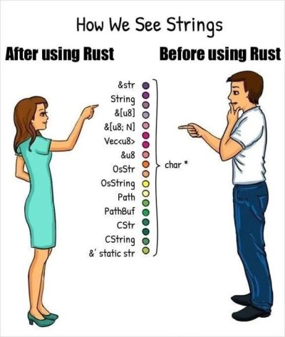

---

title: 러스트 기본 문법
published: 2024-07-29
description: 러스트의 사용법과 기본 문법 정리
image: thumb.jpg
tags: [rust, rust-syntax, 러스트, 러스트 기본 문법]
category: rust-syntax
draft: false

---

# 폴더 초기화하기

코드를 저장할 폴더를 만들고, 명령 프롬프트(cmd)나 쉘(shell)을 해당 폴더 경로로 엽니다. Visual Studio Code를 사용 중이라면 터미널을 열 수도 있습니다.

```shell
# 터미널에서 입력
$ cargo init
```

이 명령을 실행하면 여러 파일과 폴더가 생성됩니다. 우리는 `src/main.rs` 파일에서 코드를 작성할 것입니다.

# 코드 실행하기

코드를 실행하는 방법은 간단합니다. 이전에 열었던 명령 프롬프트나 쉘에서 다음 명령을 입력합니다.

```shell
$ cargo run
```

이 명령을 실행하면 `src/main.rs` 파일의 코드가 실행됩니다.

# 변수 선언 방법

```rust
let 변수명: 타입 = 값;
```

이와 같은 방식으로 변수를 생성할 수 있습니다.

- `변수명`에는 변수의 이름이 들어갑니다.
- `: 타입` 부분은 **타입 어노테이션**이라고 부르며, 생략할 수 있습니다.
- `값`에는 변수가 가질 초기 값이 들어갑니다.

## 변수 출력하기

`println!` 또는 `print!` 매크로를 사용하여 변수를 출력할 수 있습니다. 매크로는 끝에 `!`가 붙는 특별한 함수로 생각하면 됩니다.

```rust
fn main() {
    let 변수: i32 = 1;
    println!("{} {}", 변수, 변수 + 1); // 방법 1
    println!("{변수}"); // 방법 2
}
```

출력 결과:
```
1 2
1
```

- `방법 1`: 중괄호 `{}`를 사용하여 변수의 값을 출력합니다.
- `방법 2`: 변수 이름을 그대로 사용할 수 있습니다. 이 방법은 순수한 변수만 사용 가능합니다.

# 기본 타입들

러스트에는 다양한 타입이 있습니다. 여기서는 가장 기초적인 타입들을 살펴보겠습니다.

## 정수

정수 타입은 부호 있는 타입(signed)과 부호 없는 타입(unsigned)으로 나뉩니다.

- 부호 있는 타입: `i8`, `i16`, `i32`, `i64`, `i128`, `isize`
- 부호 없는 타입: `u8`, `u16`, `u32`, `u64`, `u128`, `usize`

타입의 최대값과 최소값은 `정수형::MAX`와 `정수형::MIN`으로 알 수 있습니다.

```rust
let max = i32::MAX;
let min = i32::MIN;
```

## 문자열

문자열에는 두 가지 타입이 있습니다: `&str`과 `String`.<br>
~~사실 더 많이 있지만 저 두개를 더 사용을 많이합니다~~<br>

<details>
<summary>관련 밈</summary>



</details>

### &str 타입

```rust
fn main() {
    let s: &str = "문자열";
}
```

### String 타입

`String` 타입은 `String::new()` 또는 `String::from(&str)`로 생성할 수 있습니다.

```rust
fn main() {
    let s1: String = String::new();
    let s2: String = String::from("내가 원하는 문자열");
}
```

## 배열

배열에는 두 가지 주요 타입이 있습니다: 고정 크기 배열과 벡터.

### 고정 크기 배열

```rust
fn main() {
    let arr_int: [i32; 3] = [0, 2, 5];
    let arr_str: [&str; 4] = ["5", "-", "2", "3"];
}
```

### 벡터

벡터는 가변 크기의 배열입니다. `vec![]` 매크로를 사용하여 값을 저장하고 `.push` 메서드를 사용하여 값을 추가할 수 있습니다.

```rust
fn main() {
    let mut arr: Vec<i32> = vec![2, -1, 7];
    arr.push(10); // 이제 arr의 값은 vec![2, -1, 7, 10]이 됩니다.
}
```

배열을 출력하려면 다음과 같이 할 수 있습니다.

```rust
println!("{:?}", arr);
println!("{:#?}", arr);
println!("{arr:?}");
println!("{arr:#?}");
```

:::note[포멧팅]
<br>
<details>
<summary>이건 좀 어려울수 있어요!</summary>

포맷팅을 할 때는 `{}`와 같은 문자를 사용합니다. 가끔 이 괄호 안에 무언가 들어간 것을 볼 수 있습니다. 예를 들어, `{:?}`와 같은 형태입니다. 이번에는 이러한 포맷팅 옵션에 대해 알아보겠습니다.

괄호 안의 문자는 콜론(`:`) 뒤에 옵션이 들어갑니다. 각 옵션의 의미는 다음과 같습니다:

- **`{}`**: 기본 포맷팅, `Display` 트레이트를 사용합니다.
- **`{:?}`**: 디버그 포맷팅, `Debug` 트레이트를 사용하여 값을 출력합니다.
- **`{:e}`**: 숫자를 자릿수 표기법(지수 표기법, exponential notation)으로 출력하며, 지수는 소문자 'e'로 표시됩니다.
- **`{:E}`**: 숫자를 자릿수 표기법(지수 표기법, exponential notation)으로 출력하며, 지수는 대문자 'E'로 표시됩니다.
- **`{:o}`**: 숫자를 8진법(Octal)으로 출력합니다.
- **`{:p}`**: 주소를 포인터(Pointer)로 출력합니다.
- **`{:b}`**: 숫자를 2진법(Binary)으로 출력합니다.
- **`{:x}`**: 숫자를 16진법(Hex)으로 출력하며, 16진법의 알파벳은 소문자로 표시됩니다.
- **`{:X}`**: 숫자를 16진법(Hex)으로 출력하며, 16진법의 알파벳은 대문자로 표시됩니다.

예시를 통해 각각의 포맷팅 옵션을 살펴보겠습니다:

```rust
fn main() {
    let number = 255;

    println!("Display: {}", number);         // 기본 포맷팅
    println!("Debug: {:?}", number);         // 디버그 포맷팅
    println!("Exponential (e): {:e}", number);  // 자릿수 표기법 (소문자 e)
    println!("Exponential (E): {:E}", number);  // 자릿수 표기법 (대문자 E)
    println!("Octal: {:o}", number);         // 8진법 포맷팅
    println!("Pointer: {:p}", &number);      // 포인터 포맷팅
    println!("Binary: {:b}", number);        // 2진법 포맷팅
    println!("Hex (lowercase): {:x}", number); // 16진법 포맷팅 (소문자)
    println!("Hex (uppercase): {:X}", number); // 16진법 포맷팅 (대문자)
}
```

출력 결과는 다음과 같습니다:

```shell
Display: 255
Debug: 255
Exponential (e): 2.55e2
Exponential (E): 2.55E2
Octal: 377
Pointer: 0x7ffee4a8344c
Binary: 11111111
Hex (lowercase): ff
Hex (uppercase): FF
```

이와 같이 각 포맷팅 옵션을 사용하여 데이터를 다양한 형식으로 출력할 수 있습니다.
</details>
:::

## 불리언

불리언 타입은 `true`와 `false`만을 가집니다.

```rust
let t: bool = true;
let f: bool = false;
```

# 가변성(mutable) 키워드

`mut` 키워드는 변수의 값을 변경할 수 있게 해줍니다.

```rust
fn main() {
    let mut a: i32 = 1;
    a = 2; // 이제 a의 값은 2가 됩니다.
}
```

# 상수

상수는 값을 변경할 수 없는 변수입니다. `let` 대신 `const`를 사용하여 선언합니다.

```rust
fn main() {
    const MAX_POINTS: i32 = 100_000;
}
```
러스트에서는 상수의 이름은 모두 대문자로 작성하는 것을 지향합니다.

# 조건문

`if` 문은 다음과 같이 사용합니다.

```rust
fn main() {
    let number = 3;

    if number < 5 {
        println!("조건이 맞습니다.");
    } else {
        println!("조건이 맞지 않습니다.");
    }
}
```

조건문에는 여러 가지 표현식을 사용할 수 있습니다.

```rust
a == b  // a와 b가 같다.
a != b  // a와 b가 같지 않다.
a > b   // a가 b보다 크다.
a >= b  // a가 b보다 크거나 같다.
a < b   // a가 b보다 작다.
a <= b  // a가 b보다 작거나 같다.
```

# 매치문

`match` 문은 다음과 같이 사용합니다.

```rust
fn main() {
    let number = 7;

    match number {
        1 => println!("1111111"),
        2 => println!("22222222"),
        3..=5 => println!("3 ~ 5 사이"),
        6 | 7 => println!("6 또는 7"),
        _ => println!("다른 숫자"),
    }
}
```

`_`는 모든 경우에 매칭되지 않는 값을 처리합니다.

# 반복문

러스트에는 세 가지 주요 반복문이 있습니다: `loop`, `while`, `for`.

## loop

`loop` 문은 무한 루프를 실행합니다.

```rust
fn main() {
    loop {
        println!("무한 반복");
    }
}
```

`break`를 사용하여 루프를 종료할 수 있습니다.

```rust
fn main() {
    let mut counter = 0;

    loop {
        println!("카운팅: {}", counter);
        counter += 1;

        if counter == 10 {
            break;
        }
    }
}
```

## while

`while` 문은 조건이 참인 동안 코드를 반복합니다.

```rust
fn main() {
    let mut number = 3;

    while number != 0 {
        println!("{}", number);
        number -= 1;
    }
}
```

## for

보통 `for` 문은 범위(range)를 사용할 수도 있습니다.

```rust
fn main() {
    for number in 1..4 {
        println!("{}", number);
    }
}
```

아래와 같은 형태를 `for each` 라고 하며 iterable한 객채를 넣을수 있습니다.<br>
대표적인거: `tuple`, `list`, `vector`, `hash-map`

```rust
fn main() {
    let a = [10, 20, 30, 40, 50];

    for element in a.iter() {
        println!("값: {}", element);
    }
}
```


# 함수

함수는 다음과 같이 정의합니다.

```rust
fn 함수이름(매개변수: 타입) -> 반환타입 {
    // 함수 코드
    반환값
}
```

예를 들어, 두 수를 더하는 함수는 다음과 같습니다.

```rust
fn sum(a: i32, b: i32) -> i32 {
    a + b
}
```

함수는 `return` 키워드를 사용하여 값을 반환할 수도 있습니다.

```rust
fn sum(a: i32, b: i32) -> i32 {
    return a + b;
}
```


# 소유권

러스트에서는 소유권이라는 개념이 중요합니다. 변수의 값을 다른 변수에 할당하면 원래 변수의 값을 사용할 수 없습니다.

```rust
fn main() {
    let s1 = String::from("hello");
    let s2 = s1;

    // s1은 이제 사용할 수 없습니다.
    // println!("{}",

 s1); // 에러 발생
    println!("{}", s2);
}
```

## 참조와 빌려주기

참조를 사용하여 값을 빌려줄 수 있습니다.

```rust
fn main() {
    let s1 = String::from("hello");
    let s2 = &s1;

    println!("{}", s1); // 가능
    println!("{}", s2); // 가능
}
```

## 복사하기

`clone` 메서드를 사용하여 값을 복사할 수 있습니다.

```rust
fn main() {
    let

 s1 = String::from("hello");
    let s2 = s1.clone();

    println!("{}", s1); // 가능
    println!("{}", s2); // 가능
}
```

# 구조체

구조체는 관련된 데이터를 하나의 타입으로 묶을 수 있는 방법입니다.

## 일반 구조체

일반적인 구조체는 다음과 같이 정의할 수 있습니다.

```rust
struct User {
    username: String,
    email: String,
    sign_in_count: u64,
    active: bool,
}

fn main() {
    let user1 = User {
        email: String::from("someone@example.com"),
        username: String::from("someusername123"),
        active: true,
        sign_in_count: 1,
    };

    println!("Username: {}", user1.username);
}
```

## 튜플 구조체

튜플 구조체는 필드에 이름을 붙이지 않고, 타입만을 지정하여 정의합니다.

```rust
struct Color(i32, i32, i32);
struct Point(i32, i32, i32);

fn main() {
    let black = Color(0, 0, 0);
    let origin = Point(0, 0, 0);

    println!("Black color: ({}, {}, {})", black.0, black.1, black.2);
    println!("Origin point: ({}, {}, {})", origin.0, origin.1, origin.2);
}
```

## 구조체 메서드

구조체 메서드는 `impl` 블록을 사용하여 정의합니다.

```rust
struct Rectangle {
    width: u32,
    height: u32,
}

impl Rectangle {
    fn area(&self) -> u32 {
        self.width * self.height
    }
}

fn main() {
    let rect = Rectangle { width: 30, height: 50 };

    println!("면적: {} 제곱 픽셀", rect.area());
}
```

# 열거형

열거형은 몇 개의 값을 하나의 타입으로 묶을 수 있는 방법입니다.

## 일반 열거형

일반적인 열거형은 다음과 같이 정의할 수 있습니다.

```rust
enum Message {
    Quit,
    Move { x: i32, y: i32 },
    Write(String),
    ChangeColor(i32, i32, i32),
}

fn main() {
    let msg = Message::Move { x: 10, y: 20 };

    match msg {
        Message::Quit => println!("Quit variant"),
        Message::Move { x, y } => println!("Move to ({}, {})", x, y),
        Message::Write(text) => println!("Text message: {}", text),
        Message::ChangeColor(r, g, b) => println!("Change color to ({}, {}, {})", r, g, b),
    }
}
```

# 제네릭

제네릭을 사용하면 타입에 의존하지 않는 코드를 작성할 수 있습니다. 제네릭 타입 매개변수는 `<T>`와 같은 형태로 선언합니다.

## 제네릭 함수

제네릭 함수를 정의하려면 함수 이름 앞에 `<T>`를 붙입니다.

```rust
fn largest<T: PartialOrd>(list: &[T]) -> &T {
    let mut largest = &list[0];

    for item in list {
        if item > largest {
            largest = item;
        }
    }

    largest
}

fn main() {
    let number_list = vec![34, 50, 25, 100, 65];
    let result = largest(&number_list);
    println!("가장 큰 숫자: {}", result);

    let char_list = vec!['y', 'm', 'a', 'q'];
    let result = largest(&char_list);
    println!("가장 큰 문자: {}", result);
}
```

## 제네릭 구조체

제네릭 타입을 사용하는 구조체는 다음과 같이 정의합니다.

```rust
struct Point<T> {
    x: T,
    y: T,
}

fn main() {
    let int_point = Point { x: 5, y: 10 };
    let float_point = Point { x: 1.0, y: 4.0 };

    println!("int_point: ({}, {})", int_point.x, int_point.y);
    println!("float_point: ({}, {})", float_point.x, float_point.y);
}
```

## 제네릭 이넘(enum)

제네릭 타입을 사용하는 열거형은 다음과 같이 정의합니다.

```rust
enum Option<T> {
    Some(T),
    None,
}

enum Result<T, E> {
    Ok(T),
    Err(E),
}
```

제네릭 열거형을 사용할 때 타입을 지정해주어야 합니다.

```rust
fn main() {
    let some_number: Option<i32> = Option::Some(5);
    let some_string: Option<&str> = Option::Some("Hello");

    println!("{:?}, {:?}", some_number, some_string);
}
```

## 제네릭 메서드

제네릭 타입을 사용하는 메서드는 다음과 같이 정의합니다.

```rust
struct Point<T> {
    x: T,
    y: T,
}

impl<T> Point<T> {
    fn x(&self) -> &T {
        &self.x
    }
}

fn main() {
    let p = Point { x: 5, y: 10 };

    println!("p.x = {}", p.x());
}
```

---

이상으로 러스트의 기본 문법과 제네릭에 대해 살펴보았습니다. 더 자세한 내용은 [러스트 공식 문서](https://doc.rust-lang.org/book/)를 참고하시기 바랍니다.
# 관련 책

## 만들면서 배우는 러스트 프로그래밍
파이썬과 c언어를 하셨다면 이 책이 맞을것 같습니다.<br>
https://wikibook.co.kr/rust/

## 프로그래밍 러스트
친절하지만 내용이 좀 어려워서 러스트를 좀 해본사람이 읽기 좋은 책입니다.<br>
https://product.kyobobook.co.kr/detail/S000200629958

## 제로부터 시작하는 러스트 백엔드 프로그래밍
백엔드에 관심이 없어도 러스트로 프로젝트를 해보려는 분들이 읽으면 도움이 될것같은 책입니다.<br>
https://m.yes24.com/Goods/Detail/124834028

## 러스트 프로그래밍 공식 가이드
좀 불친절하지만 러스트가 완전 처음이라면 읽어볼만 한 책입니다.<br>
https://jpub.tistory.com/1537

## **The Rust Programming Language(번역본)**
`러스트 프로그래밍 공식 가이드` 와는 다르게 무료라 돈을안쓰고 공부하고싶다면 추천합니다.
https://rinthel.github.io/rust-lang-book-ko/

## 실전! 러스트로 배우는 리눅스 커널 프로그래밍
아직 읽어보지는 못했지만 목차가 괜찮아서 커널 프로그래밍에 관심이 있으면 좋을것같은 책입니다.<br>
https://m.yes24.com/Goods/Detail/125028287

## rustacean들은 위한 러스트
utilforever님이 번역중인 책입니다.<br>
2023년 초에 나온다 했는데 아직도...
