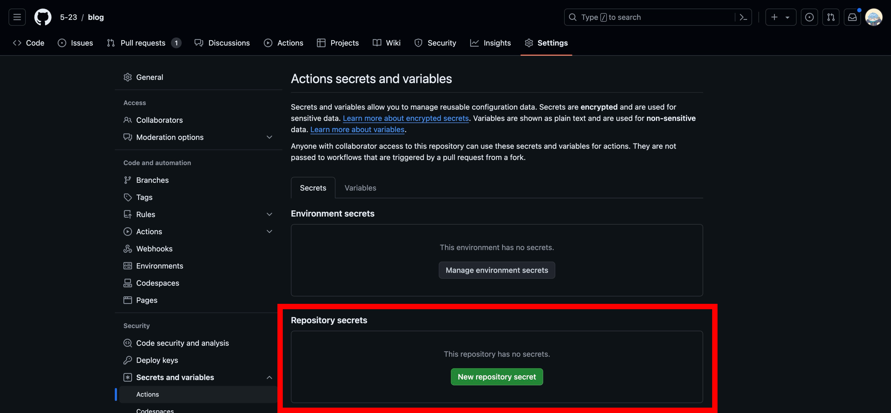
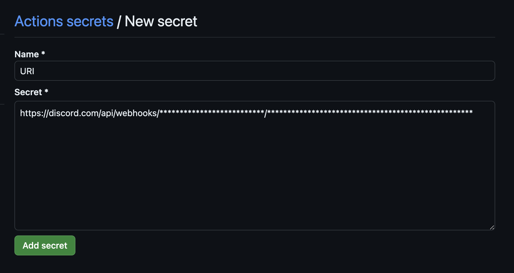
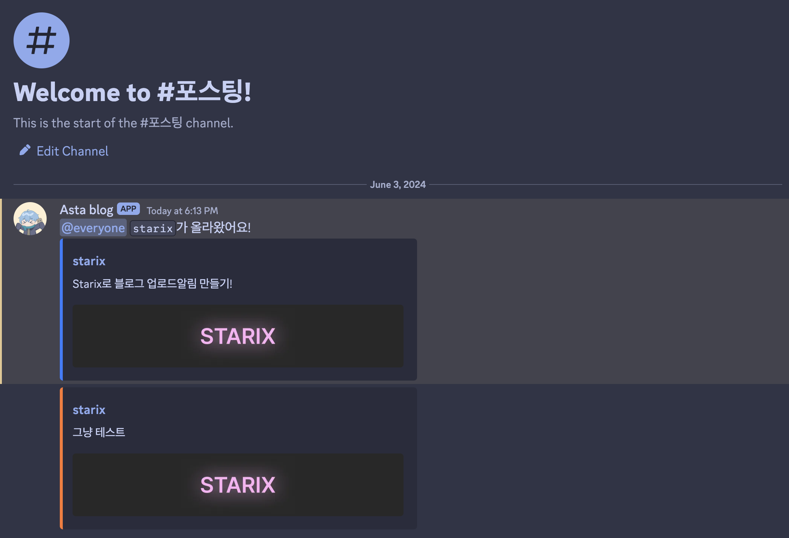

# starix
starix는 github으로 블로그를 만드는사람을 위해 만들어젔으며, commit을 할때 특정 컨벤션을 사용하면 discord로 알림을 보내게 만들어젔다.

## starix.yml
이걸 그냥 github workflow에 추가해주면된다
```
name: Read Environment Variables and Save to File

on:
  push:
    branches:
      - master

jobs:
  build:
    runs-on: macos-latest

    steps:
    - name: Checkout repository
      uses: actions/checkout@v2

    - name: download file
      run: |
        wget "https://f.5-23.dev/project/starix"
        chmod +x starix
    - name: run starix
      run: |
        sleep 120
        export URI="${{ secrets.URI }}"
        ./starix

```

## Starix.toml
{starix.id}는 블로그 id가 들어가게된다.
```toml
# 블로그 url
url="https://blog.5-23.dev/p/{starix.id}/"
# 블로그 섬네일 url
thumb="https://blog.5-23.dev/p/{starix.id}/thumb.jpg"
# 웹훅 이름
name="Asta blog"
# 웹훅 프로필
avatar="https://avatars.githubusercontent.com/u/86705803?v=4"

[post]
# 포스트시 메세지
content="@everyone `{starix.id}`가 올라왔어요!"
# 포스트시 메세지
color="#2E7EFF"

[fix]
# 수정시 메세지
content=""
# 수정시 메세지
color="#FF782E"
```
## Secrets 설정
ur-repo > Settings > Secrets and variables > Actions

저 버튼을 누른다.
name은 `URI`, secret은 디스코드 웹훅 url을 쓰면 된다.


## commmit 해보기
컨밴션 규칙은 간단하다
### 블로그 포스트
아래중에 아무거나써도 상관없다.
```
post(id): 내용
upload(id): 내용
```
### 블로그 수정
```
fix(id): 내용
```
# 결과
포스트커밋과 수정을 둘다하고 찍었습니다
