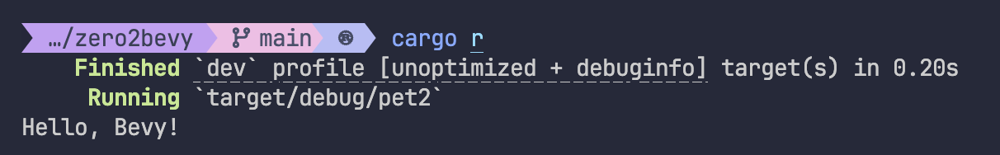
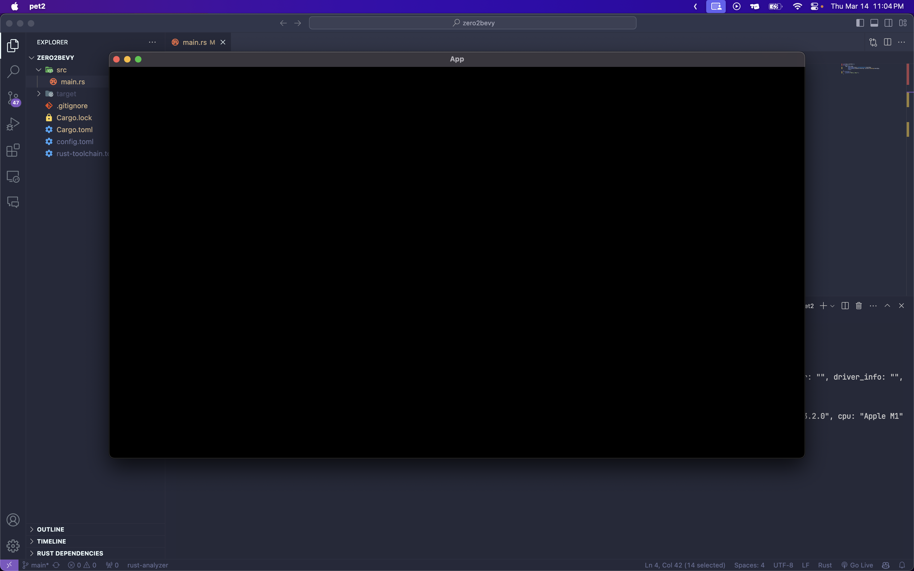

# 베비 설치
```fish
cargo new zero2bevy
cd zero2bevy
cargo add bevy
```
설치가 완료됐으면 다음과 같은 코드를 작성하여 실행해보자.
설치가 정상적으로 됐으면 오류가 없이 실행될꺼다.
```rust
use bevy::prelude::*;
fn main() {
    App::new().run();
}
```

# 실행 이벤트 감지
베비는 `add_systems(Startup, 함수)`를 사용하여 실행 이벤트를 감시할수 있다
```rs
use bevy::prelude::*;
fn main() {
    App::new()
        .add_systems(Startup, startup) // 아레 지정할 startup함수를 베비가 실행됬을때 실행한다
        .run();
}
fn startup() {
    println!("Hello, Bevy!");
}
```



# 화면 띄우기
화면을 띄우기 위해서는 plugin을 설정해줘야한다 bevy에서 plugin을 설정하고 싶다면 add_plugin메서드를 사용하면 된다
```rs
use bevy::prelude::*;
fn main() {
    App::new()
        .add_plugins(bevy::DefaultPlugins) // 기본 베비 플러그인 설정
        .add_systems(Startup, startup)
        .run();
}
fn startup() {
    println!("Hello, Bevy!");
}
```
