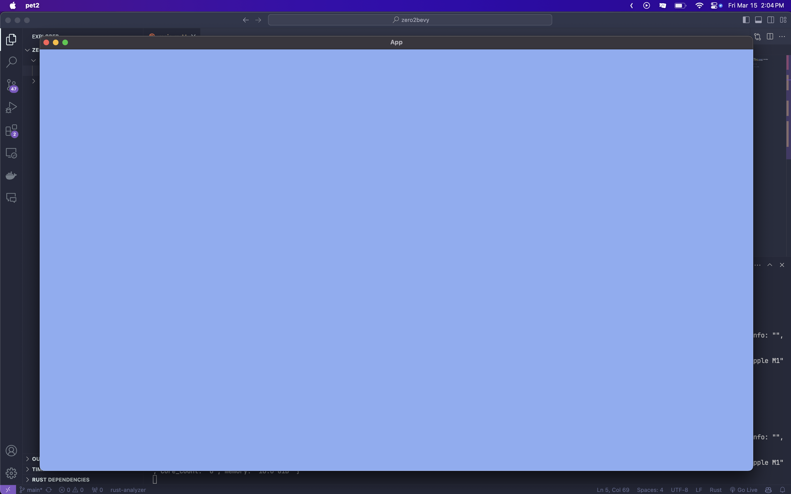

# 카메라 설정하기
화면을 보이게 하기 위해서는 카메라를 스폰해줘야한다.
```rs

fn startup(
    // 엔티티를 스폰하기 위해서 commands를 추가해준다
    mut commands: Commands
) {
    // commands.sapwn는 엔티티/번들 을 스폰하는 메서드이다
    commands.spawn(
        // 2d카메라를 기본 형식으로 스폰한다
        Camera2dBundle::default()
    );
}
```
실행하면 배경이 `검정` -> `회색`으로 바껴있을꺼다


# 배경 변경
배경을 변경하는 방법은 2개가 있다
1. main함수에서 변경
2. 함수에 있는 commands를 사용하여 변경

## main함수에서 변경
```rs
fn main() {
    App::new()
        .add_plugins(bevy::DefaultPlugins)
        .insert_resource(ClearColor(Color::hex("#8aadf4").unwrap())) // cLearColor라는것을 insert_resource를 사용하여 추가하면 배경색이 바뀐다
        .add_systems(Startup, startup)
        .run();
}
```

## setup함수에서 변경
setup을 불러오는데 시간이 좀 걸리기때문에 이 방법은 처음 배경을 초기화 할때는 추천하지 않는다
```rs
fn startup(
    // 엔티티를 스폰하기 위해서 commands를 추가해준다
    mut commands: Commands,
) {
    // commands.sapwn는 엔티티/번들 을 스폰하는 메서드이다
    commands.spawn(
        // 2d카메라를 기본 형식으로 스폰한다
        Camera2dBundle::default(),
    );
    // 배경색상 설정
    commands.insert_resource(ClearColor(Color::hex("#8aadf4").unwrap()))
}
```
