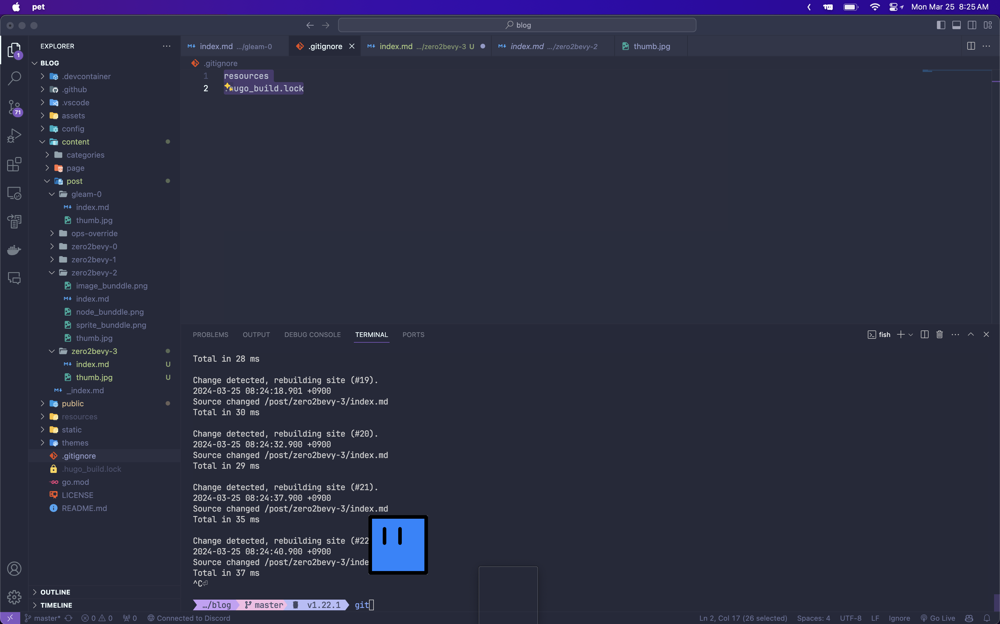

## 설정
배경을 없에기 위해 main함수에 이 옵션을 추가해줘야한다 
```rs
App::new()
    .insert_resource(ClearColor(Color::rgba(0.0, 0.0, 0.0, 0.0))) // 투명배경
    .add_plugins(DefaultPlugins.set(WindowPlugin {
        primary_window: Some(Window {
            title: "Bevy game".to_string(), // 제목
            canvas: Some("#bevy".to_owned()),
            prevent_default_event_handling: false,
            transparent: true,
            decorations: false,

            #[cfg(target_os = "macos")]
            composite_alpha_mode: CompositeAlphaMode::PostMultiplied, // 맥에서 배경 없엠

            window_level: bevy::window::WindowLevel::AlwaysOnTop,
            ..default()
        }),
        ..default()
    }))
```

## 없는곳 클릭설정
```rs
fn update_cursor_hit_test(
    click: Res<ButtonInput<MouseButton>>,
    cursor_world_pos: Res<CursorWorldPos>,
    mut q_primary_window: Query<&mut Window, With<PrimaryWindow>>,
    mut q_pet: Query<(&mut Pet, &Transform), With<Pet>>,
) {
    let mut primary_window = q_primary_window.single_mut();

    // If the window has decorations (e.g. a border) then it should be clickable
    primary_window.cursor.hit_test = true; // 이 값이 바뀔떄 배경 클릭 여부가 결정된다.
}
```


[응용코드](https://github.com/5-23/pet)
