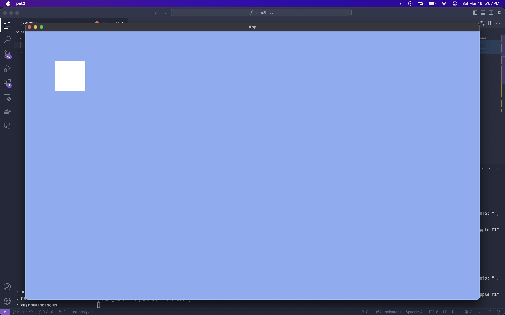
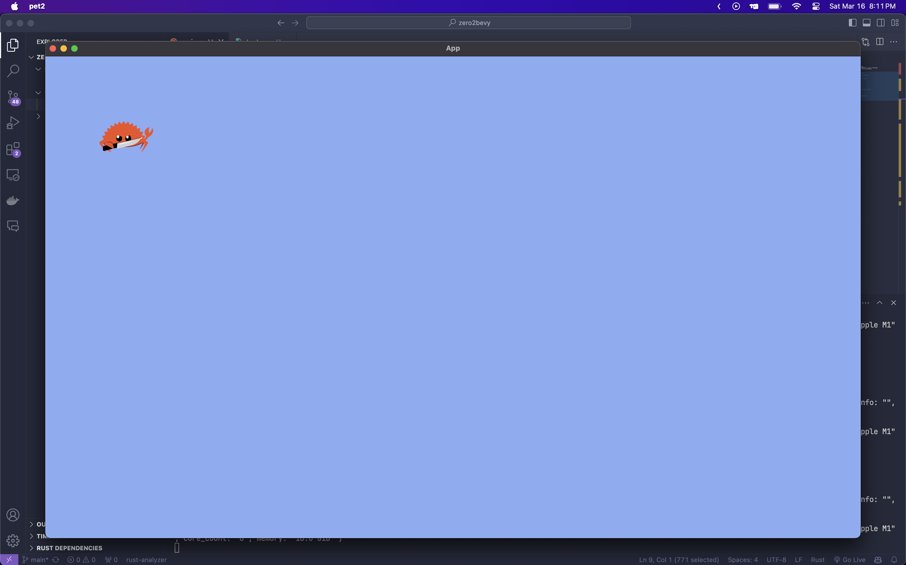
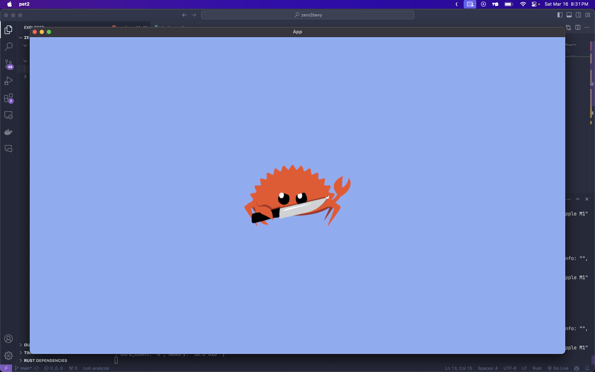

# 번들
번들은 commands.spawn을 통해 소환할수 있고, 종류가 좀 많다. 그러니 우리는 몇개만 알아보자

## NodeBundle
NodeBundle은 간단하게 화면에 사각형을 띄우기에 좋다.

NodeBundle은 다음과 같은 값이 들어간다 (많이 쓰이는것만 주석을 달아놨다)
```rs
pub struct NodeBundle {
    pub node: Node,
    pub style: Style, // 위치, 크기같은 스타일을 설정할수 있다
    pub background_color: BackgroundColor, // 배경색을 설정할수 있다
    pub border_color: BorderColor, // 아웃라인 색상을 설정할수 있다
    pub focus_policy: FocusPolicy,
    pub transform: Transform, // 기본 정보에서 값을 추가하여 조정한다
    pub global_transform: GlobalTransform,
    pub visibility: Visibility, // 보이는지 안보이는지를 설정할수 있다
    pub inherited_visibility: InheritedVisibility,
    pub view_visibility: ViewVisibility,
    pub z_index: ZIndex, // 번들이 겹첬을때 보이는 우선순위를 설정한다
}
```

예시 사용법은 다음과 같다

```rs

fn startup(
    // 엔티티를 스폰하기 위해서 commands를 추가해준다
    mut commands: Commands,
) {
    // commands.sapwn는 엔티티/번들 을 스폰하는 메서드이다
    commands.spawn(
        // 2d카메라를 기본 형식으로 스폰한다
        Camera2dBundle::default(),
    );
    commands.spawn(NodeBundle {
        style: Style {
            // 크기를 100px로 설정한다
            width: Val::Px(100.0),
            height: Val::Px(100.0),
            // 위치를 위로부터100px, 왼쪽으로부터100px로 설정한다
            top: Val::Px(100.0),
            left: Val::Px(100.0),
            ..Default::default()
        },
        //배경색을 흰색으로 설정한다
        background_color: BackgroundColor(Color::hex("#ffffff").unwrap()),
        ..Default::default()
    });
}
```


## ImageBundle
만약 `NodeBunddle`에 사진을 넣고싶다면 이걸 쓰면 된다.
여기에서는 NodeBunddle과 다르게 사진을 추가할수있는 `image`속성과 사진의 크기를 조정할수있는 `image_size`가 추가로 있다
### 세팅
일단 이미지를 불러와야해서 assets폴더를 만들어주고 아무 사진이나 assets폴더에 넣는다
경로는 이렇다
```
assets/
    - test.png // 나는 귀여운 ferris사진을 test.png라는 이름으로 넣었다
src/
    - main.rs

Cargo.lock
Cargo.toml
```

### 예시 코드
```rs
fn startup(
    // 엔티티를 스폰하기 위해서 commands를 추가해준다
    mut commands: Commands,
    // assets폴더를 로드하기 위해서 AssetServer를 추가해준다
    assets_server: Res<AssetServer>,
) {
    // commands.sapwn는 엔티티/번들 을 스폰하는 메서드이다
    commands.spawn(
        // 2d카메라를 기본 형식으로 스폰한다
        Camera2dBundle::default(),
    );
    commands.spawn(ImageBundle {
        style: Style {
            // 크기를 100px로 설정한다
            width: Val::Px(100.0),
            height: Val::Px(100.0),
            // 위치를 위로부터100px, 왼쪽으로부터100px로 설정한다
            top: Val::Px(100.0),
            left: Val::Px(100.0),
            ..Default::default()
        },
        // assets폴더에서 test.png를 로드한다
        image: assets_server.load("test.png").into(),
        //배경색을 흰색으로 설정한다
        ..Default::default()
    });
}
```



## SpriteBunddle
`SpriteBunddle`은 기본적으로 중항에 정렬된다는 특징이 있다 ui를 만드는게 아니라면 이걸 쓰면 된다.

```rs
pub struct SpriteBundle {
    pub sprite: Sprite, // 스프라이트의 크기, 위치, 색상등을 조정할수 있다.
    pub transform: Transform,
    pub global_transform: GlobalTransform,
    pub texture: Handle<Image>,
    pub visibility: Visibility,
    pub inherited_visibility: InheritedVisibility,
    pub view_visibility: ViewVisibility,
}
```

```rs
fn startup(
    // 엔티티를 스폰하기 위해서 commands를 추가해준다
    mut commands: Commands,
    // assets폴더를 로드하기 위해서 AssetServer를 추가해준다
    assets_server: Res<AssetServer>,
) {
    // commands.sapwn는 엔티티/번들 을 스폰하는 메서드이다
    commands.spawn(
        // 2d카메라를 기본 형식으로 스폰한다
        Camera2dBundle::default(),
    );
    commands.spawn(SpriteBundle {
        // assets폴더에서 test.png를 로드한다 (여기선 .into는 굳이 안써도 됨)
        texture: assets_server.load("test.png"),
        //배경색을 흰색으로 설정한다
        ..Default::default()
    });
}
```


[심화 예시](https://github.com/5-23/LIMBO/blob/main/src/main.rs#L54)