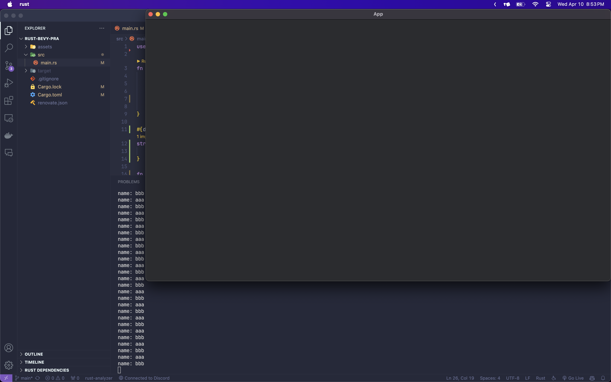

## 컴포넌트 만들기
화면에 있는 모든 객채를 검사하면 안되니 컴포넌트라는것을 만들어 하나씩 검사해보자.
나는 `MyCustomComponent`라는 이름으로 만들었는데 이름은 바꿔도 상관없다
```rs
#[derive(Component)]
struct MyCustomComponent { // 이름은 바꿔도 상관없음
    name: String,
}
```

## 컴포넌트 생성
아까 우리가 만들었던 컴포넌트를 생성해보자
```rs
fn setup(mut commands: Commands) {
    commands.spawn(Camera2dBundle::default());
    // aaa라는 이름으로 MyCustomComponent생성
    commands.spawn(MyCustomComponent {
        name: "aaa".to_string(),
    });
    
    // bbb라는 이름으로 MyCustomComponent생성
    commands.spawn(MyCustomComponent {
        name: "bbb".to_string(),
    });
}
```

## 이벤트 만들기
컴포넌트까지 생성했으니 이제 이벤트를 만들어보자

```rs
fn main() {
    App::new()
        // ...생략
        .add_systems(Update, component_info) // Update시스템: 계속 반복되면서 실행되게 해줌
        .run();
}

fn component_info(
    // 지금 생성되있는 모든 MyCustomComponent 컴포넌트의 정보를 가져옴
    q: Query<&MyCustomComponent>,
) {
    // 소환한 모든 컴포넌트를 반복문을 사용하여 출력
    for component in q.iter() {
        // 아까 생성한 컴포넌트의 이름을 출력
        println!("name: {}", component.name);
    }
}
```
