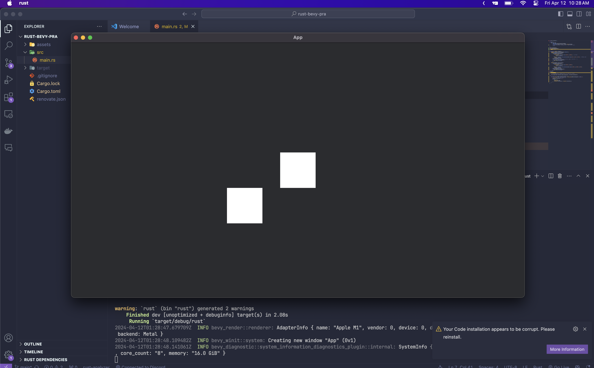
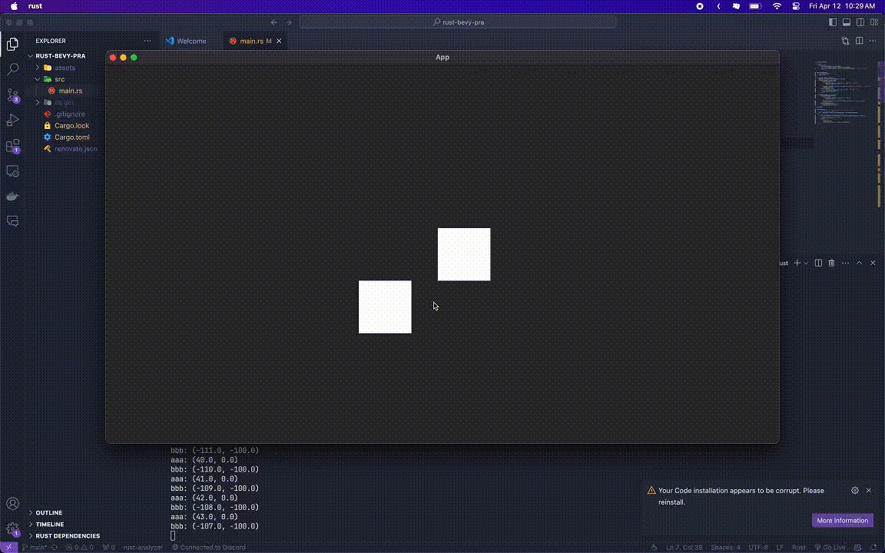

# 번들에 컴포넌트 삽입하기
번들을 삽입하려면 스폰을 한후 `.insert(컴포넌트)`를 사용하여 삽입을 할수 있다
```rs
#[derive(Component)]
struct MyCustomComponent {
    name: String,
}

fn setup(mut commands: Commands) {
    // ..생략
    commands
        .spawn(SpriteBundle {
            sprite: Sprite {
                custom_size: Some(Vec2::new(100.0, 100.0)), // 크기 설정
                ..Default::default()
            },
            transform: Transform::from_translation(Vec3::new(0.0, 0.0, 0.0)), // 기본위치 설정
            ..Default::default()
        })
        // sprite번들에 MyCustomComponent 컴포넌트를 추가해서 특정 정보를 저장
        .insert(MyCustomComponent {
            name: "aaa".to_string(),
        });

    commands
        .spawn(SpriteBundle {
            sprite: Sprite {
                custom_size: Some(Vec2::new(100.0, 100.0)),
                ..Default::default()
            },
            transform: Transform::from_translation(Vec3::new(-150.0, -100.0, 0.0)),
            ..Default::default()
        })
        .insert(MyCustomComponent {
            name: "bbb".to_string(),
        });
}
```


# 번들 값 수정하기
번들의 값을 가저오거나 수정하기 위해서는 Query문을 자세히 알아야한다. <br/> 
기본적으로 Query문은 `Query<(&가, &mut 저, mut 오, 려, &는, &mut 값), With<컴포넌트>>` 이런식의 타입을 가지고 있고 가저오려는 값에는 다음과 같은 값이 들어갈수 있다(비교적 많이쓰는것만 써저있어 다른것도 들어갈수있다)

| 이름/반환타입 | 설명 |
| ---------- | --- |
| Transfrom | 위치값을 변경할수있는 값을 반환한다 [*](https://github.com/5-23/rust-bevy-pra/blob/41d80a3e2e6bd174527247998288b3eb2156f4e0/src/main.rs#L55) | 
| Style | nodebunddle종류의 번들의 스타일을 변경 가능하다 | 
| Entity | 나중에 번들을 디스폰 할때 사용된다 [*](https://github.com/5-23/rust-bevy-pra/blob/41d80a3e2e6bd174527247998288b3eb2156f4e0/src/main.rs#L138)  | 
| BackgroundColor | nodebunddle종류의 번들의 스타일을 변경 가능하다  | 
| 컴포넌트(자기자신) | 자신의 값을 얻어올수있다  | 

```rs
fn main() {
    App::new()
        // ...생략
        .add_systems(Update, component_move) // 계속 실행되는 시스템
        .run();
}

fn component_move(
    // 지금 생성되있는 모든 MyCustomComponent 컴포넌트의 정보를 가져옴
    // 수정해야해서 mut q로 받는다
    mut q: Query<(&mut Transform, &MyCustomComponent, &Style), With<MyCustomComponent>>,
) {
    // 소환한 모든 컴포넌트를 반복문을 사용하여 출력
    for (mut transform, custome_comp, e) in &mut q {
        // 아까 생성한 컴포넌트의 이름을 출력
        transform.translation.x += 1.;
        println!(
            "{}: {:?}",
            custome_comp.name,
            (transform.translation.x, transform.translation.y)
        );
    }
}
```
